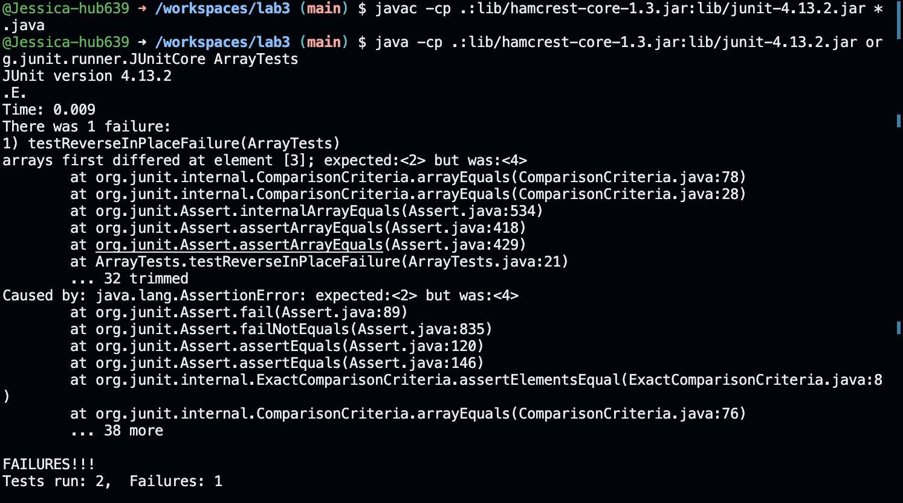

# Lab 3

## Part 1
### Test which ends up not a Failure and another that does repectively
```java
@Test
public void testReverseInPlaceNoFailure() {
    int[] original = new int[]{};
    ArrayExamples.reverseInPlace(original);
    assertArrayEquals(new int[]{}, original);
}
```

```java
@Test
    public void testReverseInPlaceFailure() {
        int[] original = new int[]{1, 2, 3, 4, 5};
        ArrayManipulation.reverseInPlace(original);
        assertArrayEquals(new int[]{5, 4, 3, 2, 1}, original);
    }
```




### Before
```java
static void reverseInPlace(int[] arr) {
    for(int i = 0; i < arr.length; i += 1) {
      arr[i] = arr[arr.length - i - 1];
    }
  }
```

### After
```java
static void reverseInPlace(int[] arr) {
    for(int i = 0; i < arr.length / 2; i += 1) {
        int temp = arr[i];
        arr[i] = arr[arr.length - i - 1];
        arr[arr.length - i - 1] = temp;
    }
  }
```

For `reverseInPlace`, the fix makes sure the loop only goes through half of the array. It swaps items from the ends towards the middle, using a temporary space to hold an item during the swap. This prevents the program from replacing items incorrectly.

## Part 2 : Using `find` with Options on `./technical`

### 1. **-name**
This option allows you to search for files by name.

 ``` find ./technical/plos -name "*pmed*" ```
```
./technical/plos/pmed.0020273.txt
./technical/plos/pmed.0020065.txt
./technical/plos/pmed.0020071.txt
./technical/plos/pmed.0020059.txt
./technical/plos/pmed.0010039.txt
./technical/plos/pmed.0010010.txt
./technical/plos/pmed.0020104.txt
./technical/plos/pmed.0020272.txt
./technical/plos/pmed.0020258.txt
./technical/plos/pmed.0020099.txt
./technical/plos/pmed.0010013.txt
./technical/plos/pmed.0020113.txt
./technical/plos/pmed.0020098.txt
./technical/plos/pmed.0020067.txt
./technical/plos/pmed.0020073.txt
./technical/plos/pmed.0020249.txt
./technical/plos/pmed.0020275.txt
./technical/plos/pmed.0020088.txt
./technical/plos/pmed.0020103.txt
./technical/plos/pmed.0020117.txt
./technical/plos/pmed.0020116.txt
./technical/plos/pmed.0020102.txt
./technical/plos/pmed.0020062.txt
./technical/plos/pmed.0020274.txt
./technical/plos/pmed.0020048.txt
./technical/plos/pmed.0020060.txt
./technical/plos/pmed.0020074.txt
./technical/plos/pmed.0020114.txt
./technical/plos/pmed.0010028.txt
./technical/plos/pmed.0010029.txt
./technical/plos/pmed.0020115.txt
./technical/plos/pmed.0020075.txt
./technical/plos/pmed.0020061.txt
./technical/plos/pmed.0020210.txt
./technical/plos/pmed.0020238.txt
./technical/plos/pmed.0010066.txt
./technical/plos/pmed.0020198.txt
./technical/plos/pmed.0010067.txt
./technical/plos/pmed.0020007.txt
./technical/plos/pmed.0020239.txt
./technical/plos/pmed.0020005.txt
./technical/plos/pmed.0020039.txt
./technical/plos/pmed.0010071.txt
./technical/plos/pmed.0010058.txt
./technical/plos/pmed.0010070.txt
./technical/plos/pmed.0010064.txt
./technical/plos/pmed.0020158.txt
./technical/plos/pmed.0020206.txt
./technical/plos/pmed.0020212.txt
./technical/plos/pmed.0020216.txt
./technical/plos/pmed.0020028.txt
./technical/plos/pmed.0020148.txt
./technical/plos/pmed.0020160.txt
./technical/plos/pmed.0010048.txt
./technical/plos/pmed.0010060.txt
./technical/plos/pmed.0010061.txt
./technical/plos/pmed.0010049.txt
./technical/plos/pmed.0020161.txt
./technical/plos/pmed.0020149.txt
./technical/plos/pmed.0020015.txt
./technical/plos/pmed.0020203.txt
./technical/plos/pmed.0020201.txt
./technical/plos/pmed.0020017.txt
./technical/plos/pmed.0010062.txt
./technical/plos/pmed.0020189.txt
./technical/plos/pmed.0020162.txt
./technical/plos/pmed.0020016.txt
./technical/plos/pmed.0020002.txt
./technical/plos/pmed.0020200.txt
./technical/plos/pmed.0020231.txt
./technical/plos/pmed.0020027.txt
./technical/plos/pmed.0020033.txt
./technical/plos/pmed.0010047.txt
./technical/plos/pmed.0010046.txt
./technical/plos/pmed.0010052.txt
./technical/plos/pmed.0020191.txt
./technical/plos/pmed.0020146.txt
./technical/plos/pmed.0020232.txt
./technical/plos/pmed.0020226.txt
./technical/plos/pmed.0020024.txt
./technical/plos/pmed.0020018.txt
./technical/plos/pmed.0020144.txt
./technical/plos/pmed.0020150.txt
./technical/plos/pmed.0020187.txt
./technical/plos/pmed.0010050.txt
./technical/plos/pmed.0010051.txt
./technical/plos/pmed.0020192.txt
./technical/plos/pmed.0010045.txt
./technical/plos/pmed.0020145.txt
./technical/plos/pmed.0020019.txt
./technical/plos/pmed.0020237.txt
./technical/plos/pmed.0020009.txt
./technical/plos/pmed.0020035.txt
./technical/plos/pmed.0020021.txt
./technical/plos/pmed.0020155.txt
./technical/plos/pmed.0010069.txt
./technical/plos/pmed.0010041.txt
./technical/plos/pmed.0020182.txt
./technical/plos/pmed.0020196.txt
./technical/plos/pmed.0020197.txt
./technical/plos/pmed.0010068.txt
./technical/plos/pmed.0020140.txt
./technical/plos/pmed.0020020.txt
./technical/plos/pmed.0020034.txt
./technical/plos/pmed.0020236.txt
./technical/plos/pmed.0020208.txt
./technical/plos/pmed.0020022.txt
./technical/plos/pmed.0020036.txt
./technical/plos/pmed.0010056.txt
./technical/plos/pmed.0020195.txt
./technical/plos/pmed.0010042.txt
./technical/plos/pmed.0020181.txt
./technical/plos/pmed.0020180.txt
./technical/plos/pmed.0020194.txt
./technical/plos/pmed.0020157.txt
./technical/plos/pmed.0020023.txt
./technical/plos/pmed.0020235.txt
./technical/plos/pmed.0020209.txt
./technical/plos/pmed.0020246.txt
./technical/plos/pmed.0020050.txt
./technical/plos/pmed.0020118.txt
./technical/plos/pmed.0010030.txt
./technical/plos/pmed.0010024.txt
./technical/plos/pmed.0010025.txt
./technical/plos/pmed.0020086.txt
./technical/plos/pmed.0020045.txt
./technical/plos/pmed.0020247.txt
./technical/plos/pmed.0020047.txt
./technical/plos/pmed.0020090.txt
./technical/plos/pmed.0010026.txt
./technical/plos/pmed.0020085.txt
./technical/plos/pmed.0020091.txt
./technical/plos/pmed.0020278.txt
./technical/plos/pmed.0020268.txt
./technical/plos/pmed.0010022.txt
./technical/plos/pmed.0010036.txt
./technical/plos/pmed.0010023.txt
./technical/plos/pmed.0020123.txt
./technical/plos/pmed.0020094.txt
./technical/plos/pmed.0020257.txt
./technical/plos/pmed.0020055.txt
./technical/plos/pmed.0020082.txt
./technical/plos/pmed.0010021.txt
./technical/plos/pmed.0010034.txt
./technical/plos/pmed.0010008.txt
./technical/plos/pmed.0020120.txt
./technical/plos/pmed.0020040.txt
./technical/plos/pmed.0020068.txt
./technical/plos/pmed.0020281.txt
./technical/plos/pmed.0020242.txt **
```

This command will list all files related to `pmed` within the `./technical/plos` subdirectory.


### 2. **-name**
``` find ./technical/plos -name "*journal*" ```
```
./technical/plos/journal.pbio.0030032.txt
./technical/plos/journal.pbio.0020354.txt
./technical/plos/journal.pbio.0020156.txt
./technical/plos/journal.pbio.0020140.txt
./technical/plos/journal.pbio.0020183.txt
./technical/plos/journal.pbio.0020430.txt
./technical/plos/journal.pbio.0020394.txt
./technical/plos/journal.pbio.0020431.txt
./technical/plos/journal.pbio.0020419.txt
./technical/plos/journal.pbio.0020169.txt
./technical/plos/journal.pbio.0020035.txt
./technical/plos/journal.pbio.0030024.txt
./technical/plos/journal.pbio.0020223.txt
./technical/plos/journal.pbio.0020019.txt
./technical/plos/journal.pbio.0020145.txt
./technical/plos/journal.pbio.0020353.txt
./technical/plos/journal.pbio.0020347.txt
./technical/plos/journal.pbio.0020420.txt
./technical/plos/journal.pbio.0020346.txt
./technical/plos/journal.pbio.0020187.txt
./technical/plos/journal.pbio.0020150.txt
./technical/plos/journal.pbio.0020232.txt
./technical/plos/journal.pbio.0030021.txt
./technical/plos/journal.pbio.0020224.txt
./technical/plos/journal.pbio.0020146.txt
./technical/plos/journal.pbio.0020350.txt
./technical/plos/journal.pbio.0020190.txt
./technical/plos/journal.pbio.0020147.txt
./technical/plos/journal.pbio.0030051.txt
./technical/plos/journal.pbio.0020068.txt
./technical/plos/journal.pbio.0020054.txt
./technical/plos/journal.pbio.0020040.txt
./technical/plos/journal.pbio.0030131.txt
./technical/plos/journal.pbio.0020337.txt
./technical/plos/journal.pbio.0020121.txt
./technical/plos/journal.pbio.0030050.txt
./technical/plos/journal.pbio.0020241.txt
./technical/plos/journal.pbio.0020043.txt
./technical/plos/journal.pbio.0030127.txt
./technical/plos/journal.pbio.0020042.txt
./technical/plos/journal.pbio.0020297.txt
./technical/plos/journal.pbio.0030094.txt
./technical/plos/journal.pbio.0020046.txt
./technical/plos/journal.pbio.0020052.txt
./technical/plos/journal.pbio.0030137.txt
./technical/plos/journal.pbio.0030136.txt
./technical/plos/journal.pbio.0020127.txt
./technical/plos/journal.pbio.0020133.txt
./technical/plos/journal.pbio.0020053.txt
./technical/plos/journal.pbio.0020047.txt
./technical/plos/journal.pbio.0030056.txt
./technical/plos/journal.pbio.0030097.txt
./technical/plos/journal.pbio.0020125.txt
./technical/plos/journal.pbio.0020440.txt
./technical/plos/journal.pbio.0020263.txt
./technical/plos/journal.pbio.0020101.txt
./technical/plos/journal.pbio.0030105.txt
./technical/plos/journal.pbio.0020302.txt
./technical/plos/journal.pbio.0020100.txt
./technical/plos/journal.pbio.0020262.txt
./technical/plos/journal.pbio.0030065.txt
./technical/plos/journal.pbio.0020276.txt
./technical/plos/journal.pbio.0020116.txt
./technical/plos/journal.pbio.0020063.txt
./technical/plos/journal.pbio.0030076.txt
./technical/plos/journal.pbio.0030062.txt
./technical/plos/journal.pbio.0020067.txt
./technical/plos/journal.pbio.0020073.txt
./technical/plos/journal.pbio.0020113.txt
./technical/plos/journal.pbio.0020311.txt
./technical/plos/journal.pbio.0030102.txt
./technical/plos/journal.pbio.0020310.txt
./technical/plos/journal.pbio.0020112.txt
./technical/plos/journal.pbio.0020272.txt
./technical/plos/journal.pbio.0020064.txt
./technical/plos/journal.pbio.0020306.txt
./technical/plos/journal.pbio.0030129.txt
./technical/plos/journal.pbio.0020307.txt
./technical/plos/journal.pbio.0020105.txt
./technical/plos/journal.pbio.0020071.txt
./technical/plos/journal.pbio.0020267.txt
./technical/plos/journal.pbio.0020228.txt
./technical/plos/journal.pbio.0020214.txt
./technical/plos/journal.pbio.0020348.txt
./technical/plos/journal.pbio.0020406.txt
./technical/plos/journal.pbio.0020215.txt
./technical/plos/journal.pbio.0020001.txt
./technical/plos/journal.pbio.0020161.txt
./technical/plos/journal.pbio.0020439.txt
./technical/plos/journal.pbio.0020404.txt
./technical/plos/journal.pbio.0020148.txt
./technical/plos/journal.pbio.0020028.txt
./technical/plos/journal.pbio.0020216.txt
./technical/plos/journal.pbio.0020206.txt
./technical/plos/journal.pbio.0020010.txt
./technical/plos/journal.pbio.0020164.txt
./technical/plos/journal.pbio.0020400.txt
./technical/plos/journal.pbio.0020401.txt
./technical/plos/journal.pbio.0020213.txt
./technical/plos/journal.pbio.0020013.txt
./technical/plos/journal.pbio.0020172.txt
./technical/plos/journal.pbio.0020012.txt
```
This command helps locate all files related to `journal` within the `./technical/plos` subdirectory, useful for specific document retrievals.

### 3. **-type**
``` find ./technical -type d ```
```
./technical
./technical/government
./technical/government/About_LSC
./technical/government/Env_Prot_Agen
./technical/government/Alcohol_Problems
./technical/government/Gen_Account_Office
./technical/government/Post_Rate_Comm
./technical/government/Media
./technical/plos
./technical/biomed
./technical/911report
```
This command lists every directory within `./technical`, helping you understand the folder structure.

### 4. **-type**
``` find ./technical -type f ```

```
...
./technical/911report/chapter-3.txt
./technical/911report/chapter-2.txt
./technical/911report/chapter-1.txt
./technical/911report/chapter-5.txt
./technical/911report/chapter-6.txt
./technical/911report/chapter-7.txt
./technical/911report/chapter-9.txt
./technical/911report/chapter-8.txt
./technical/911report/preface.txt
./technical/911report/chapter-12.txt
./technical/911report/chapter-10.txt
./technical/911report/chapter-11.txt
```
(The output is just the last few files output from the command)
This lists all regular files, ignoring directories, links, etc., which is helpful for file-based operations.


### 5. **-mtime**
``` find ./technical -mtime -7 ```

```
...
./technical/911report/chapter-3.txt
./technical/911report/chapter-2.txt
./technical/911report/chapter-1.txt
./technical/911report/chapter-5.txt
./technical/911report/chapter-6.txt
./technical/911report/chapter-7.txt
./technical/911report/chapter-9.txt
./technical/911report/chapter-8.txt
./technical/911report/preface.txt
./technical/911report/chapter-12.txt
./technical/911report/chapter-10.txt
./technical/911report/chapter-11.txt
```
This command identifies files recently modified within the last week, useful for tracking recent changes. (It showed all the files, the output above is just the last few)

### 6. **-mtime**
``` find ./technical -mtime +30 ```

```  ```
This helps identify older files that haven't been modified in over a month. As you can see there was no output, which means all the files where modified within the month.


### 7. **-siza**
``` find ./technical -size -200c ```

```
./technical
./technical/government/Alcohol_Problems
```
Find files smaller than 200 bytes in `./technical`. This is useful for identifying small files, potentially for a review or to ensure they're not unnecessary clutter. 

### 8. **-siza**
``` find ./technical -size +100k ```
```
./technical/government/About_LSC/commission_report.txt
./technical/government/About_LSC/State_Planning_Report.txt
./technical/government/Env_Prot_Agen/multi102902.txt
./technical/government/Env_Prot_Agen/ctm4-10.txt
./technical/government/Env_Prot_Agen/bill.txt
./technical/government/Env_Prot_Agen/tech_adden.txt
./technical/government/Gen_Account_Office/d0269g.txt
./technical/government/Gen_Account_Office/GovernmentAuditingStandards_yb2002ed.txt
./technical/government/Gen_Account_Office/Sept27-2002_d02966.txt
./technical/government/Gen_Account_Office/d01376g.txt
./technical/government/Gen_Account_Office/Statements_Feb28-1997_volume.txt
./technical/government/Gen_Account_Office/pe1019.txt
./technical/government/Gen_Account_Office/gg96118.txt
./technical/government/Gen_Account_Office/d01591sp.txt
./technical/government/Gen_Account_Office/im814.txt
./technical/government/Gen_Account_Office/ai9868.txt
./technical/government/Gen_Account_Office/May1998_ai98068.txt
./technical/government/Gen_Account_Office/d02701.txt
./technical/biomed/1471-2105-3-2.txt
./technical/911report/chapter-13.4.txt
./technical/911report/chapter-13.5.txt
./technical/911report/chapter-13.2.txt
./technical/911report/chapter-13.3.txt
./technical/911report/chapter-3.txt
./technical/911report/chapter-1.txt
./technical/911report/chapter-6.txt
./technical/911report/chapter-7.txt
./technical/911report/chapter-9.txt
./technical/911report/chapter-12.txt
```
Find files larger than 100KB in `./technical`.This command helps find larger files, which might be consuming significant disk space.


source: [Link Text]([URL](https://www.tecmint.com/35-practical-examples-of-linux-find-command/)) - where I looked to find commands.
