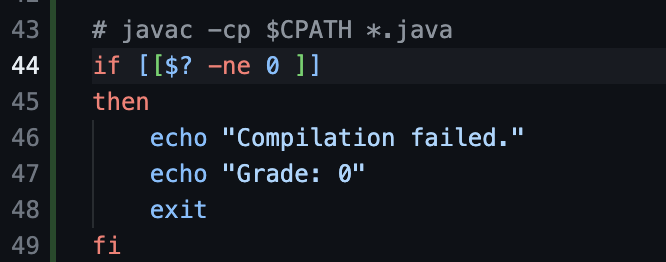

# Lab 5

## Student Post
I'm trying to run the `grade.sh` script to grade a student's submission, but I'm encountering an error. The script successfully clones the repository and finds the `ListExamples.java` file, but there must be an issue with line 44 but I don't know what's the issue. Anyway then it fails with the message

