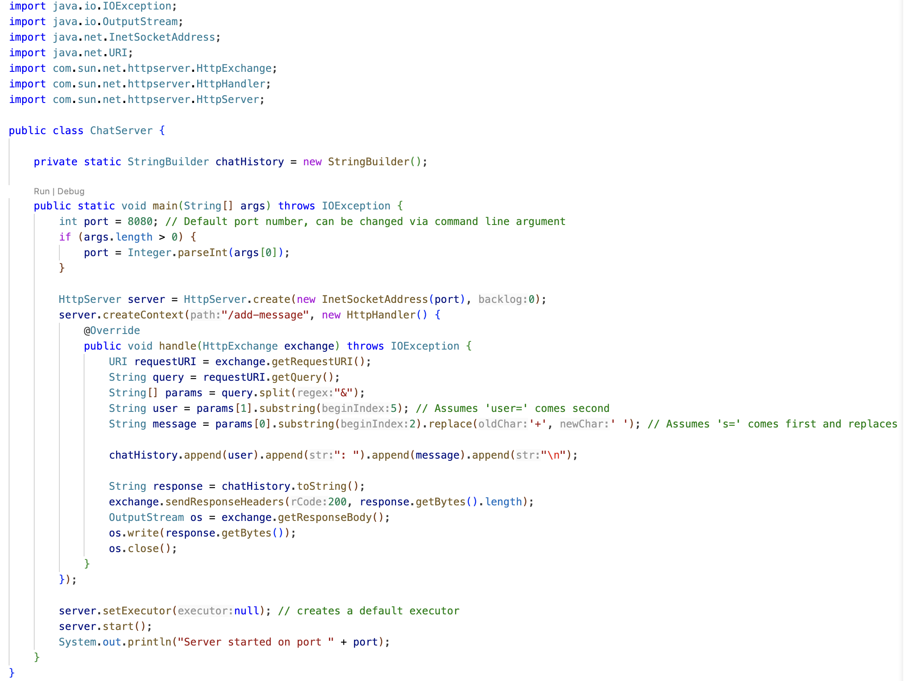
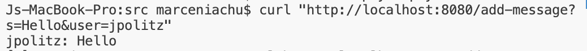
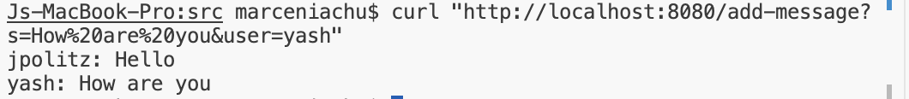

# Lab report 2

## First Screenshot
* Method Called: `handle(HttpExchange exchange)`
  
What are the relevant arguments to those methods, and the values of any relevant fields of the class?
* `HttpExchange exchange`: Contains the HTTP request details.
* `StringBuilder chatHistory`: Starts Empty.

How do the values of any relevant fields of the class change from this specific request? If no values got changed, explain why.
* `chatHistory` changes from an empty string to `"jpolitz: Hello"`.

## Second Screenshot
* Method Called: `handle(HttpExchange exchange)`
 
What are the relevant arguments to those methods, and the values of any relevant fields of the class?
* `HttpExchange exchange`: Contains the HTTP request details.
* `StringBuilder chatHistory`: `"jpolitz: Hello"` .

How do the values of any relevant fields of the class change from this specific request? If no values got changed, explain why.
* `chatHistory` updates to `"jpolitz: Hello\nyash: How are you\n"`

