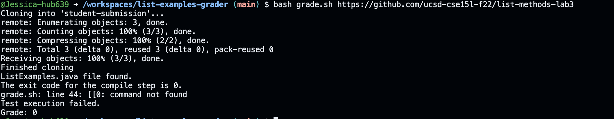
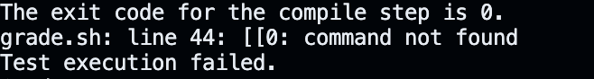
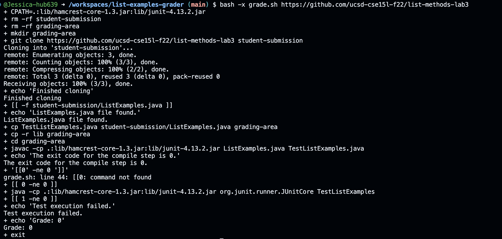

# Lab 5

## Student Post
I'm trying to run the `grade.sh` script to grade a student's submission, but I'm encountering an error. The script successfully clones the repository and finds the `ListExamples.java` file, which also has the problem of the test failing. Anyway then it fails with the message





## TA response 

It looks like there might be a syntax error in your `grade.sh` script on line 44. The `[[` command is used for conditional expressions in bash, but it seems like there might be a typo or incorrect usage. Could you share the code around line 44 of your `grade.sh` script? Additionally, try running the script with `bash -x grade.sh` to get more detailed output and see where it goes wrong. 

## Student
I ran the script with `bash -x` and found that the error occurs due to a missing space after the opening `[[` in line 44.


### File directory and Structure 
```
grader/
│
├── grade.sh
└── student-submission/
    └── ListExamples.java
```

### grade.sh
```
CPATH='.:lib/hamcrest-core-1.3.jar:lib/junit-4.13.2.jar'

rm -rf student-submission
rm -rf grading-area

mkdir grading-area


git clone $1 student-submission
echo 'Finished cloning'


# Draw a picture/take notes on the directory structure that's set up after
# getting to this point

# Then, add here code to compile and run, and do any post-processing of the
# tests

if [[ -f student-submission/ListExamples.java ]]
then 
    echo "ListExamples.java file found."
    
else 
    echo "ListExamples.java file not found."
    echo "Grade: 0"
    exit
fi 

#TestListExamples.java, ListExamples.java, lib directory
cp TestListExamples.java student-submission/ListExamples.java grading-area
cp -r lib grading-area

#Step 4
cd grading-area
javac -cp $CPATH *.java

echo "The exit code for the compile step is $?."


# javac -cp $CPATH *.java
if [[$? -ne 0 ]]
then
    echo "Compilation failed."
    echo "Grade: 0"
    exit
fi
```

### Full command line to trigger the bug 
```
bash grade.sh https://github.com/ucsd-cse15l-f22/list-methods-compile-error/
```

### Description of the fix 
To fix the bug, you need to add a space between `[[` and the first operand in the conditional expression on line 44.

## R
During the second half of this quarter, I learned about the importance of robust error handling in shell scripts. Specifically, I discovered how subtle syntax errors, such as missing spaces in conditional expressions, can lead to significant issues


