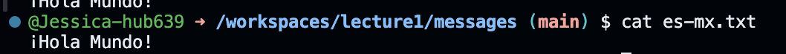

# Lab report 1

##Command:'cd'
* Working Directory Before Command: '/home/lecture1'
* Explanation: The cd command without any arguments changes the current directory to the user's home directory.
* No Error output

## Command: 'cd messages'
* Working Directory Before Command: /home/lecture1
* Output: No visual output.
* Explanation: Changes the current directory to messages which is inside lecture1.
* No Error output
  

##Command: 'cd es-mx.txt'
* Working Directory Before Command: '/home/username/lecture1/messages'
* Output: bash: cd: es-mx.txt: Not a directory
* Explanation: An error occurs because es-mx.txt is a file, and cd can only change directories.
   

## Command: 'ls'
* Working Directory Before Command: /home/username/lecture1
* Output: Shows files Hello.java  README  messages .
* No Error Output
 

## Command: 'ls messages'
* Output: ls: cannot access 'messages': No such file or directory
* Explanation: The command tries to list the contents of a directory named messages inside the current directory (/workspaces/lecture1/messages). Since there's no subdirectory named messages within the messages directory, the command fails with an error.
 

## Command: 'ls es-mx.txt'
* Output: es-mx.txt
* Explanation: This command lists the specific file es-mx.txt, confirming its presence in the current directory.
 

## Command : 'cat'
* Working Directory Before Command: '/home/username/lecture1/messages'
* Output: Waits for input; then displays the input.
* Explanation: 'cat' without arguments reads from standard input until you end it with ctrl-D
 

## Command: 'cat messages'
* Working Directory Before Command: /home/username/lecture1
* Output: cat: 'messages: Is a directory'
* Explanation: Produces an error because cat cannot read a directory, only files.
 
 
## Command: 'cat es-mx.txt'
* Working Directory Before Command: /home/username/lecture1/messages
* Output: Displays the content of 'es-mx.txt'.
* Explanation: Reads and outputs the content of the specified file.
 
