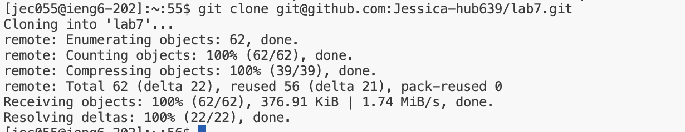
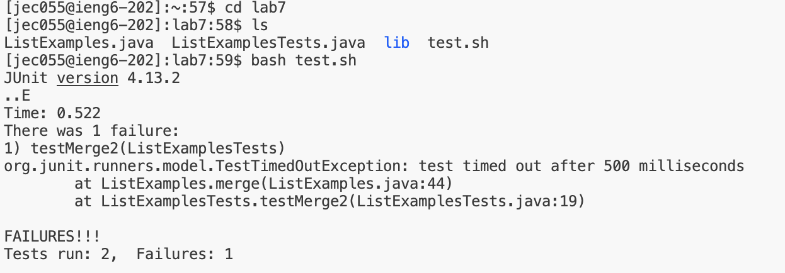
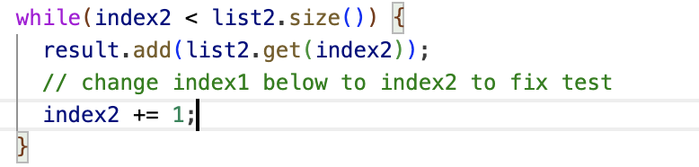

# Lab 4

## Step 4
Keys Pressed : `ssh<space>your_username@ieng6.ucsd.edu<enter>`,  command initiates a secure shell session to log into the ieng6 server using my username. This allows me to access the server remotely and run commands on it


## Step 5
Keys Pressed : `git<space>clone<space>git@github.com:Jessica-hub639/lab7.git<enter>`, command clones the repository from your GitHub account to your local machine. This creates a local copy of the repository where you can make changes and run tests.



## Step 6 
Keys Pressed : `cd<space>lab7<enter>`, changes the directory to the cloned repository. `bash<space>test.sh<enter>`, runs the test script included in the repository. The script executes the tests, and the output will show if the tests fail or pass.



## Step 7
Fixed code 



## Step 8
Keys Pressed :  `bash<space>test.sh<enter>`, again will re-execute the test script.

```
JUnit version 4.13.2
..
Time: 0.514

OK (2 tests)
```

## Step 9

` git<space>add<space>ListExamples.java<enter>`, stages the changes made to the `ListExamples.java file.`
`git<space>commit<space>-m<space>"Fixed failing test"<enter>`, commits the changes with a message describing the fix.
`git<space>push<space>origin<space>main<enter>`,pushes the committed changes to the main branch of your forked repository on GitHub.
